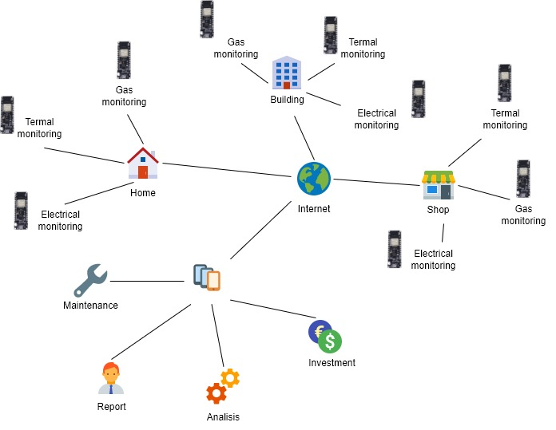

# School and Energy Community
## Campionato Nazionale Siemens 2023
### Finalità
Il presente progetto ha come finalità il monitoraggio energetico di edifici al fine di ottenere:
- in fase **preliminare** le informazioni utili per il dimensionamento di impianti di produzione da energia rinnovabile a servizio comunità energetiche;
- a **regime** le informazioni dettagliate circa il consumo degli impianti costituenti la comunità energetica.

Il monitoraggio energetico si riferisce sia all'energia **elettrica** sia all'energia **termica** o ad altra forma di energia prodotta o immagazzinazzinata, come ad esempio quella **chimica** o quella ottenibile dallo stoccaggio di gas come l'aria compressa.

Il sistema di monitoraggio si basa su componenti a bassissimo costo con alto livello di affidabilità, alimentati a batteria in modo che possano essere inseriti in qualsiasi impianto in modo non intrusivo e sicuro, ovvero senza la necessità di dover intervenire e/o modificare l'impianto oggetto di monitoraggio.
Tali componenti sono in grado di trasmettere le informazioni senza intermediari web direttamente su Google Sheet per essere elaborati da opportuna interfaccia software.

### Architettura del sistema
La figura seguente mostra il sistema a stella di raccolta dati
 

