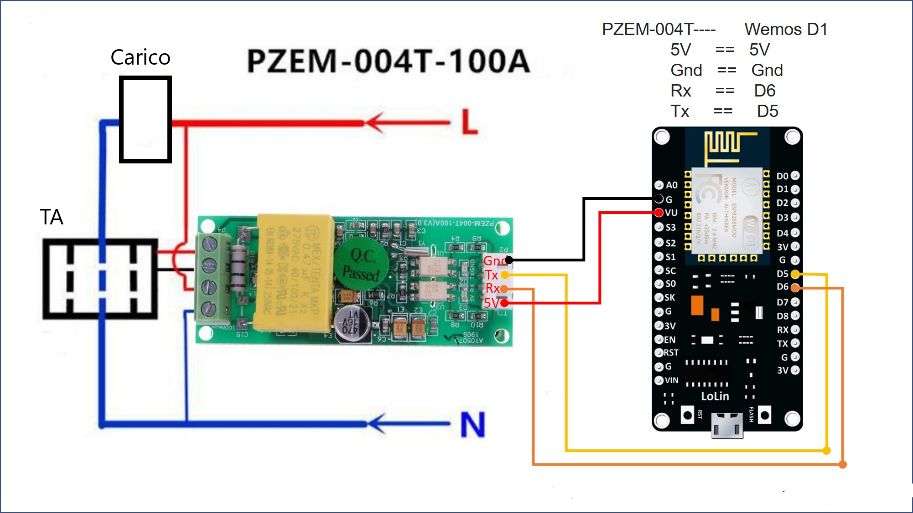
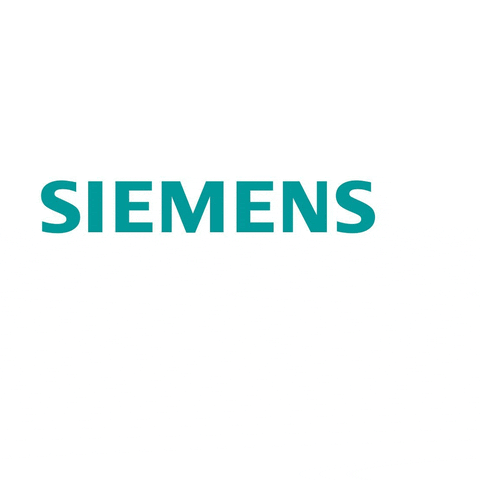
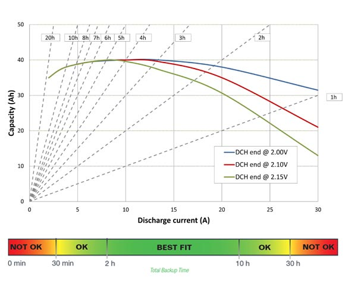

# Schools as Energy Communities
## Campionato Nazionale Siemens 2023
 

### Premessa
Con il problema del cambiamento climatico che si fa, di giorno in giorno, sempre più urgente, molti Stati stanno applicando politiche economico-sociali più o meno radicali, finalizzate ad arginare questo catastrofico processo.
In Italia, queste politiche sono state affidate alla responsabilità del “Ministero della transizione ecologica” (ora chiamato  Ministero dell'Ambiente e della Sicurezza energetica). La transizione ecologica è quell’insieme di politiche, di stampo ambientalista, volte a rendere maggiormente sostenibile l’attuale sistema produttivo. L’ormai ex governo Draghi istituì questo ministero non solo, si fa per dire, per affrontare la crisi ambientale, ma anche con un occhio di riguardo per i giovani. L’attenzione del governo per i ragazzi è stata forte e aveva come scopo quello di poter distaccare il loro pensiero da abitudini sbagliate, ormai consolidate. Molti imprenditori si preoccupano infatti solo dell’assetto economico, ignorando il problema sociale che questa crisi ha messo sotto i riflettori. Come chiarisce Francesco Gesualdi dalle pagine di «Avvenire», il 10% della popolazione mondiale più ricca produce il 49% di tutta l’anidride carbonica emessa dai consumi mondiali, il 50% più povero ne produce solo il 7%. Da questo dato emerge la necessità di una radicale riforma sociale, in quanto gli effetti del cambiamento climatico si scateneranno con intensità maggiore verso i popoli e le classi meno abbienti. Questo cammino tuttavia può essere invertito, a patto che si intervenga in tempo, attraverso alcuni cambiamenti del modello economico e dello stile di vita del nostro tessuto sociale. Perché ciò avvenga, è necessario però che il cambiamento sia reso desiderabile e vantaggioso, invece di una dura pillola da buttare giù, in quanto nessuno, quasi sicuramente, abbandonerà il proprio confortevole stile di vita per adottarne un altro scomodo e privo di sfizi. L’aveva già compreso Alexander Langer, il pioniere dell’ambientalismo, quando disse che la transizione sarebbe stata possibile solo se fosse apparsa socialmente desiderabile.

La transizione di cui stiamo parlando presenta dunque tre aspetti: ecologico, economico e sociale.

Il progetto che stiamo presentando cerca di ripercorrerli tutti. Innanzitutto esso ha come obiettivo l’efficientamento energetico, quindi ha un’utilità di tipo sociale. Esso trova infatti una perfetta realizzazione all’interno di comunità energetiche, ovvero in un insieme di famiglie, ma anche di aziende che, facendo ricorso a fonti rinnovabili, si autosostengono energeticamente. Il fare rete è un concetto che si lega indubbiamente a questo progetto e guarda all’esperienza che, ad un altro livello, è stata sperimentata attraverso la creazione di associazioni di cittadini come le reti Lilliput, che hanno avuto tra i loro promotori padre Alex Zanotelli.   

Nei più giovani, queste scelte energetiche vengono sempre più accolte e apprezzate, mentre non si può dire lo stesso delle vecchie generazioni, che non hanno mai cambiato le proprie abitudini, spesso ignare del fatto che sono state proprio queste ultime a portare il mondo nelle attuali condizioni. La transizione ecologica non sembra suscitare un interesse significativo, almeno per il 65% della popolazione mondiale, di cui i due terzi sono over 50. I giovani rappresentano il motore del cambiamento, per condurre il futuro ad una mobilitazione verso una transizione sociale che sia una “conversione” ecologica in grado di mitigare davvero gli effetti del cambiamento climatico. Dobbiamo impegnarci ad un cambiamento drastico delle nostre vite quotidiane, ma anche del modello economico che ci ha portato alle condizioni in cui ci troviamo oggi.

Del resto l’ambientalismo ha un volto giovane, basti pensare all’esperienza di Greta Thumberg, ma anche di Severn Cull Suzuki o Boyan Slat.
Forse non tutti si rendono conto che la sponda del fiume dove ci troviamo è sbagliata, ma il futuro siamo noi e siamo persone diverse dalle generazioni antecedenti: dobbiamo fare quello che non è mai stato fatto in precedenza: garantire un futuro radioso alle prossime generazioni. 

### Finalità
Il presente progetto ha come finalità il monitoraggio energetico di edifici scolastici e di edifici in genere al fine di ottenere:
- in fase **preliminare** le informazioni utili per il risparmio energetico e per il dimensionamento di impianti di produzione da energia rinnovabile a servizio di comunità energetiche;
- a **regime** le informazioni dettagliate circa il consumo e l'utilizzo ottimale degli impianti costituenti future comunità energetiche.

Il monitoraggio energetico si riferisce sia all'energia **elettrica** sia all'energia **termica** o ad altra forma di energia prodotta o immagazzinata.

Il sistema di monitoraggio utilizza componenti a bassissimo costo di dimensioni ridotte e con alto livello di affidabilità. Alimentati a batteria sono adatti per essere inseriti in qualsiasi impianto in modo non intrusivo e sicuro, ovvero senza la necessità di dover intervenire e/o modificare i circuiti oggetto di monitoraggio.
Tali componenti sono in grado di trasmettere le informazioni via **WiFi** oppure attraverso una rete **LoRaWAN**, senza intermediari web direttamente su Google Sheets per essere elaborati da opportuna interfaccia software.

Attualmente in commercio esistono svariati servizi di monitoraggio piu' o meno intrusivi. Ne citiamo qui uno per tutti offerto gratuitamente da [e-Distribuzione](https://www.e-distribuzione.it/servizi/contatore/le-mie-letture.html) con relativa [App per smartphone](https://play.google.com/store/apps/details?id=com.enel.mobile.edistribuzione&hl=it&gl=US). Cercheremo in seguito di sfruttare al meglio questi dati aggregati nei casi in cui risultano disponibili all'utente. Tuttavia si tratta sempre di servizio di monitoraggio che, anche quando attivabile, non interagisce piu' di tanto con l'impianto. Altri servizi/prodotti anche se piu' "interattivi", sono pensati normalmente per un monitoraggio lacale di **una singola utenza**. Vedremo invece come il progetto **Schools as Energy Communities** sia in grado di gestire/coordinare al meglio i consumi di **un gruppo di utenze** disperse su un territorio, come sono appunto le comunità energetiche, ottimizzando altresì i diversi sistemi di accumulo che utilizzano tecnologie differenti con relativi limiti e vantaggi, quali ad esempio le batterie al litio e le batterie al sale fuso.

Il progetto nasce dall'idea di monitorare i consumi della nostra scuola [IIS Galilei Artiglio](https://www.iisgalileiartiglio.edu.it/) per contribuire inizialmente ad individuare ed eliminare sprechi energetici e successivamente per fornire strumenti utili anche all'Amministrazione Pubblica al fine di costituire comunità energetiche di scuole e/o di altre realtà del territorio.

### Peculiarità del progetto
Il presente lavoro si rivolge a tutti, in particolare ai non esperti, utilizzando tecnologie robuste ed affidabili a bassisimo costo e open source come Google Scripts. La parola d'ordine è **semplificare il piu' possibile** rendendo accessibile a chiunque concetti e pratiche che spesso sono per addetti ai lavori. Pensiamo che ognuno debba essere e sentirsi protagonista in questa sfida importante a favore dell'ambiente e che le abilità e le competenze dell'esperto non debbano apparire come un sapere inaccessibile ma un "bene comune" da condividere. In altre parole chiunque abbia uno smartphone e ovunque si trovi è in grado di *addestrare* il sistema di monitoraggio, di leggere i consumi energetici e di interagire con i carichi mediante il PLC Siemens. Se poi in alternativa allo smartphone può indossare un paio di occhiali per la **realtà aumentata** tipo [Google Glass](https://www.google.com/glass/start/), allora può sfruttare appieno le potenzialità del sistema sviluppato, come descritto piu' avanti. 

Il progetto infatti sfrutta l'interfaccia di Google Sheets per consentire all'utente di **personalizzare** in modo semplice ma potente le proprie richieste.

### Semplificare la parola d'ordine ma ... senza banalizzare !
In passato l'energia elettrica è sempre stata intesa come un **servizio**. Oggi abbiamo compreso che in realtà è un **bene prezioso** da gestire attentamente. La sfida quindi è sfruttare al meglio l'energia, riducendone innanzitutto gli sprechi e consumandola quando è disponibile ed a prezzi vantaggiosi per l'utente. Questa affermazione ovvia, ma di non semplice attuazione, assume un peso maggiore di fronte a comunità energetiche dove la domanda e l'offerta da energia rinnovabile risponde a dinamiche proprie di ciascuna singola realtà costituente la comunità stessa. Tuttavia pensando per esempio alle scuole o ad altre strutture pubbliche affini, sarebbe importante capire a priori i consumi energetici specifici. Ad esempio osservando i consumi necessari all'illuminazione artificiale di due o piu' scuole, si potrebbero confrontare i watt per mq assorbiti per aula a parità di efficienza luminosa tenendo conto ovviamente anche dell'illuminazione naturale. Oppure si potrebbero paragonare i consumi termici di edifici costruiti negli stessi periodi, ovvero con involucri edili simili, per capire quali azioni possono essere intraprese per allineare il piu' possibile i consumi a standard comuni. Per far questo occorre una tecnologia di facile installazione, "leggera" ed a basso costo, che limiti al minimo essenziale i punti di misura. Deve inoltre essere flessibile, cioè in grado di poter utilizzare diverse tipologie di sensori per la misura di svariati parametri fisici (temperatura, luminosità, umidità, corrente, tensione, cosfi, ecc) ma soprattutto essere in grado di comunicare con **PLC Siemens S7 1x00** in modo immediato (ai fini del progetto può essere utilizzata indifferentemente la serie 1200 o la serie 1500) ed essere installata su PLC esistenti attraverso un semplice upgrade del software.

### Realtà aumentata ###
I componenti scelti nel progetto per il monitoraggio "low cost" sono costituiti da microprocessori ESP32 programmati in microPython in grado di scrivere direttamente i valori delle grandezze fisiche d'interesse in tempo reale su [Google Sheets](https://www.google.it/intl/it/sheets/about/) senza intermediari Web. 
Di seguito si riporta lo schema che prevede una espansione per l'acquisizione di quattro segnali analogici utilizzati per la lettura dei consumi elettrici compreso il cosfì e lo schema con un modulo completo di PT100 "pronto all'uso" per la misura delle temperature di mandata e ritorno delle tubazioni di riscaldamento.
Naturalmente gli scenari che si possono costruire sono molteplici. In rete si trovano svariate librerie in microPython che permettono di sfruttare al meglio le caratteristiche di ESP32. Ad esempio cliccando su [questo link](https://awesome-micropython.com/) si possono trovare diversi progetti interessanti.
Tuttavia ci teniamo a precisare che il progetto ***Schools as Energy Communities*** non è frutto di un mero "copia & incolla", ma al contrario le librerie utilizzate sono state sviluppate ad hoc dal gruppo di lavoro dell'IIS Galilei Artiglio al fine di ottenere un risultato unico nel suo genere.
Da notare che gli ESP32 sono alimentati a batteria e quindi sono indipendenti dal resto dell'impianto oggetto di monitoraggio e che lo stato di carica della batteria al litio è anch'esso registrato in una casella di spreadsheet il cui valore, se al di sotto di una soglia stabilita, può essere comunicato al manutentore via e-mail o es WA grazie al servizio [Google Apps Script](https://www.google.com/script/start/) per la sostituzione/ricarica. 
Per la misura delle grandezze elettriche sono state testate due configurazioni differenti. La prima con ingombri piu' contenuti, la seconda decisamente piu' performante (range di corrente 0-100A) grazie all'impiego del modulo [pzem 004T](https://campaign.aliexpress.com/wow/gcp/tesla-pc-new/index?UTABTest=aliabtest377151_530968&src=google&src=google&albch=shopping&acnt=494-037-6276&slnk=&plac=&mtctp=&albbt=Google_7_shopping&albagn=888888&isSmbAutoCall=false&needSmbHouyi=false&albcp=19207365798&albag=&trgt=&crea=it1005005240221539&netw=x&device=c&albpg=&albpd=it1005005240221539&gclid=Cj0KCQiApKagBhC1ARIsAFc7Mc4sLJtWKsG2DWV9fJhrSRxdA5QtR7MutY_AMWTpsr_HQ6s8PoMyp3caAjPBEALw_wcB&gclsrc=aw.ds&aff_fcid=d1059ce134da4d1797faa3b6694c52f6-1678381409693-05151-UneMJZVf&aff_fsk=UneMJZVf&aff_platform=aaf&sk=UneMJZVf&aff_trace_key=d1059ce134da4d1797faa3b6694c52f6-1678381409693-05151-UneMJZVf&terminal_id=b2bf54e51ae14d1fb4aaea66631be667&wh_weex=true&wx_navbar_hidden=true&wx_navbar_transparent=true&ignoreNavigationBar=true&wx_statusbar_hidden=true&bt_src=ppc_direct_lp&scenario=pcBridgePPC&productId=1005005240221539&OLP=1085100208_f_group2&o_s_id=1085100208)

**Schema con espansione analogica per la misura delle GRANDEZZE ELETTRICHE**

 

**Schema con modulo PZEM 004T per la misura delle GRANDEZZE ELETTRICHE**

**Schema con modulo PT100 per la misura di TEMPERATURA**

Nel progetto ***Schools as Energy Communities***, qualsiasi sia la grandezza fisica misurata, questa è facilmente accessibile attraverso la **realtà aumentata**.  
Infatti, per migliorare la percezione da parte dell'utente dei consumi, si è pensato di sfruttare una tecnologia che probabilmente in futuro sarà sempre piu' presente nei processi tecnologici. Tuttavia la sfida è stata quella di poter applicare la realtà aumentata anche in contesti piu' generici come quelli di edifici esistenti non tecnologicamente avanzati. 

Facendo riferimento agli occhiali [Google Glass Enterprise Edition 2](https://www.google.com/glass/start/), il codice per lo scanner di QR Code è scaricabile da questo [link](https://github.com/googlesamples/glass-enterprise-samples/tree/master/QRCodeScannerSample). Altri esempi di codice per l'utilizzo degli occhiali con comandi vocali ed altro è disponibile alla pagina [Google Glass Enterprise E2](https://developers.google.com/glass-enterprise/samples/code-samples?hl=it).
Questo è lo scenario preferito per il progetto ***Schools as Energy Communities*** che prevede un uso "aperto" della realtà aumentata personalizzabile in base alle necessità dell'utente.

Nel caso ad esempio di impianti elettrici e termici solitamente vetusti a servizio delle scuole, si vuole offrire la possibilità al tecnico e/o al manutentore dell'Amministrazione Provinciale o Comunale, di avere l'andamento dei consumi osservando semplicemente il quadro elettrico o la centrale termica oggetto d'indagine.
Per far questo si possono indossare occhiali tipo [Google Glass](https://www.google.com/glass/start/) o in alternativa si può utilizzare uno smartphone o un tablet qualsiasi ed inquadrare il QR Code posto sul quadro elettrico o sull'utenza. Per la lettura del QR Code il progetto prevede l'utilizzo di [Google Lens](https://play.google.com/store/apps/details?id=com.google.ar.lens&hl=it&gl=US&pli=1).

### PLC S7 1x00: il vero punto di forza ###
Abbiamo detto dell'importanza del monitoraggio condiviso su cloud e della reperibilità delle informazioni mediante QR Code. Adesso si tratta di renderle operative sfruttando il web server del PLC Siemens. Il gruppo di lavoro del Galilei Artiglio ha realizzato un file Javascript in grado di leggere i contenuti delle celle desiderate e di passare i valori alle variabili del PLC.

In questo modo il cerchio si chiude, nel senso che gli algoritmi impostati su foglio Sheet possono interagire con le uscite dell' S7 1x00 per la gestione dei carichi d'interesse. 
Soffermiamoci un attimo su questo passaggio: le misure energetiche di diversi impianti dispersi sul territorio, sono raccolte all'interno di un foglio di calcolo presente nel Cloud ed accessibile online da piu' utenti secondo restrizioni impostate. Le celle di detto foglio, valorizzate da specifici algoritmi o da valori impostati dagli stessi utenti, costituiscono l'input per uno o piu' PLC Siemens connessi agli impianti costituenti la comunità energetica. Così un sistema distribuito di edifici attivi-passivi diversi per destinazione ed utilizzo, è gestito in modo integrato come se si trattasse di un unico impianto e dove ogni utente può interagire alla pari con la parte che gli compete. 

E' anche possibile individuare impianti o porzioni di impianto da attivare ad esempio con autorizzazione attraverso un account personale. L'attivazione è naturalmente un'azione libera dell'utente che in quel preciso momento però è a conoscenza dell'energia prodotta e consumata dalla comunità energetica. La consapevolezza dei consumi e dell'energia rinnovabile disponibile possono favorire un "virtuoso" cambio di abitudini.  

Di seguito è data la possibilità al lettore di testare le capacità del file sviluppato dal gruppo di lavoro, in grado di far comunicare il PLC Siemens direttamente con i contenuti di Google Sheets. Per prima cosa inquadrare il QR Code seguente con lo smartphone (si consiglia di utilizzare il menu "Cerca" dell'App [Google Lens](https://play.google.com/store/apps/details?id=com.google.ar.lens&hl=it&gl=US) dopo aver inquadrato il QR Code)

 oppure clicca [qui](https://docs.google.com/spreadsheets/d/1h_7r-1QIDCGWO_2RPkeEgHg4gKenMNhIaW_HhNjRBwU/edit#gid=0)

Se le cose sono andate a buon fine dovreste trovarvi all'interno di un foglio Sheet dove sono riportati semplicemente dei numeri di colore rosso sotto l'etichetta "Carico 1, Carico 2, ... Carico 6". Inserite dallo smartphone nuovi numeri a piacere facendo attenzione di indicare i decimali con la virgola (i valori numerici si inseriscono in basso a sinistra nel campo fx che appare dopo aver selezionato la cella da modificare).

Aprite con Chrome questo [Link di TEST](https://www.albertodelcarlo.it/see/indextest1.html) e dovreste vedere i numeri che avete inserito. Potete cambiarli nuovamente da smartphone e premere il tasto refresh del Browser per l'aggiornamento, oppure attendere il refresh automatico ogni sei secondi.

Non è argomento di questo lavoro la cura dell'interfaccia grafica dei fogli se non nella misura funzionale e comprensibile per il raggiungimento delle finalità citate. Tuttavia si ricordano le diverse possibilità di creazione di interfacce utente attraverso le [Class Ui](https://developers.google.com/apps-script/reference/base/ui) di Google App Scripts nonchè attraverso l'installazione di componenti aggiuntivi dal menu *Estensioni*

### Architettura del sistema di monitoraggio
La figura seguente mostra in sintesi le relazioni tra i principali componenti del sistema di monitoraggio low cost ed i PLC S7 1x00 Siemens. Si ribadisce che le informazioni scambiate tra gli ESP32 ed i PLC con i servizi APP Script utilizzati nel progetto, tra cui Google Sheets, avvengono **senza intermediari Web**.
 

### Tecnica NILM e una possibile alternativa del Galilei Artiglio ###
La caratterizzazione dei consumi elettrici di piu' utilizzatori attraverso un'unica misura a monte dell'impianto è un argomento studiato da tempo. Si possono trovare online diversi [studi accademici](https://scholar.google.it/scholar?q=non+intrusive+load+monitoring+academic&hl=it&as_sdt=0&as_vis=1&oi=scholart) che trattano l'argomento di questa tecnica che prende il nome di [NILM](https://en.wikipedia.org/wiki/Nonintrusive_load_monitoring) che significa *Non intrusive load monitoring*. Nella sostanza, alla base del metodo, c'è lo studio, la ricerca di come poter **disaggregare** il dato numerico della misura. Infatti ad ogni carico elettrico inserito corrisponde un aumento di corrente totale assorbita. La misura a monte quindi è un dato **aggregato** che corrisponde alla somma di tutte le correnti.

 

Ogni sforzo dunque è nel tentativo di riconoscere, partendo dal risultato finale ovvero la misura, il valore esatto dei vari contributi che lo generano. In pratica è un percorso inverso da come abitualmente lo conosciamo. E' come dire: il numero 10 è la somma di 3+2+5. Sì è vero, ma è anche il risultato della somma 6+4. Quale delle due ipotesi è quella giusta ? Per tentare di dare una risposta la tecnica NILM utilizza reti neurali ad hoc in combinazione al tipo di sensori utilizzati. Normalmente si tratta di sistemi chiusi o proprietari, ciascuno con un proprio grado di affidabilità.

Il progetto dell'[IIS Galilei Artiglio](https://www.iisgalileiartiglio.edu.it/) accoglie dunque la seguente sfida:  è possibile caricare su un PLC Siemens un algoritmo NILM per disaggregare real-time le misure di un impianto che sfrutta il servizio Google Sheets? E l'algoritmo NILM è veramente così potente ed affidabile da rispettare rigorosamente la prima legge di Kirchhoff ? La risposta è nel prosieguo del presente lavoro. 
Si ricorda tuttavia che il sistema di monitoraggio è pensato sia per carichi **elettrici** sia per carichi **termici** ed inoltre l'ambito di applicazione dell'algoritmo seguente va oltre le comunità energetiche rivolgendosi anche a tutte quelle realtà operative in ambito terrestre e navale che vogliono conoscere gli assorbimenti dei singoli carichi attraverso una unica misura a monte.

*Vediamo allora se esiste concretamente una risposta ai quesiti formulati*   

Di seguito si riporta un esempio con cinque utenze. Essendo una simulazione offline del PLC, per avere risultati credibili, si raccomanda il lettore di completare i valori dei campi secondo il criterio della prima legge di Kircchoff. Ovviamente se la **somma fasoriale** non è rispettata il sistema risponderà con un messaggio di alert. 
L'IIS Galilei Artiglio ha sviluppato due modalità di lavoro dell'algoritmo: 
- la prima carica i valori dai campi di Google Sheets ed elabora il risultato attraverso il web server;
- la seconda carica i valori ed elabora il risultato direttamente nel web server.

In pratica sfruttando il web server del PLC Siemens possiamo ottenere gli stessi risultati come mostrato nel video di presentazione del progetto **Schools as Energy Communities**.

Per collegarsi alla prima simulazione occorre inquadrare il QR Code seguente per accedere al foglio di calcolo 

oppure clicca [qui](https://docs.google.com/spreadsheets/d/1qaaYU8EboEuMRaaWy5-ZcyvymIP7pTEFVKYNS9VD1iQ/edit#gid=0)

Cliccare poi sul [Link del web server del PLC Siemens](https://www.albertodelcarlo.it/see/sumcombinenilm.html) e premere il pulsante di analisi dell'algoritmo NILM dopo aver valorizzato le celle di spreadsheet. L'errore assoluto impostabile dall'utente deve essere maggiore di zero (non esistono misure senza errori). Se due o piu'correnti sono esattamente uguali in modulo e fase (caso molto raro, si veda la risoluzione della misura riportata di seguito) rispetto all'errore assoluto, l'algoritmo propone la soluzione scegliendo una corrente dall'insieme dei casi possibili. Va ricordato che nei casi reali due o piu' carichi *esattamente* uguali sono intercambiabili ai fini energetici.
Si ribadisce che nella realtà esiste una relazione matematica tra dato aggregato e dato disaggregato. 

***In altre parole il concetto da tenere in mente in ambedue le simulazioni è : valorizzo le celle delle correnti delle singole utenze (fase di addestramento) e successivamente valorizzo la cella della misura come somma vettoriale di una o piu' utenze affinchè l'algoritmo individui la combinazione dei carichi (fase di riconoscimento). L'errore assoluto ha un ruolo fondamentale nell'individuazione delle combinazioni possibili***

Preme qui evidenziare che nella modalità di funzionamento "online" le celle sono valorizzate dalla misura di ESP32 come mostrato nel video di presentazione del progetto.

Di seguito il link della PRIMA modalità di lavoro dell'algoritmo

 [Link Web Server PLC Siemens](https://www.albertodelcarlo.it/see/sumcombinenilm.html)

Nella SECONDA modalità di lavoro lo switch-off elimina il contributo del singolo carico ma la memorizzazione dell'assorbimento rimane inalterata e si ripristina con lo switch-on.
Cliccare sul successivo link per utilizzare la seconda modalità di lavoro dell'algoritmo NILM

 [Link Web Server PLC Siemens](https://www.albertodelcarlo.it/see/sumcombine.html)

La conoscenza del dato disaggregato, ovvero dell'assorbimento dei singoli carichi, permette di:
- stabilire un eventuale elenco di utenze secondarie da disconnettere in caso di consumo eccessivo rispetto all'accumulo considerato e/o dell'irraggiamento solare;
- conoscere il cosfì del singolo utilizzatore per un eventuale rifasamento;
- conoscere l'effettivo consumo del singolo utilizzatore anche in termini di manutenzione programmata/efficienza nel tempo;
- valorizzare economicamente l'utilizzo delle utenze piu' significative da un punto di vista dei consumi per un impiego piu' oculato;
- valutare economicamente le sostituzioni con utenze che utilizzano tecnologie piu' moderne (es. led, inverter, controllori PID ecc.);
- migliorare/modificare le abitudini di consumo dell'utente grazie anche all'utilizzo combinato con il PLC Siemens S7 1x00.

Il sensore di misura utilizzato nel progetto è il PZEM-004T che ha un range di misura 0-100A con le seguenti caratteristiche:
- misura di tensione: risoluzione di 0.1V con accuratezza dello 0.5%
- misura di corrente: risoluzione di 0.001A con accuratezza dello 0.5%
- misura di potenza attiva: risoluzione di 0.1W con accuratezza dello 0.5%
- misura del cosfì: risoluzione di 0.01 con accuratezza dell'1%
- misura della frequenza: risoluzione di 0.1Hz con accuratezza dello 0.5%
- misura dell'energia attiva: risoluzione di 1Wh con accuratezza dello 0.5%

In ogni caso la "bontà" delle misure della corrente, del cosfì e dell'energia può essere eventualmente verificata/allineata alle misure messe a disposizione ogni 15 minuti dal servizio di [e-Distribuzione](https://www.e-distribuzione.it/servizi/contatore/le-mie-letture.html) sottoforma di file csv da importare in Google Sheet. In questo modo il servizio di e-Distribuzione può essere integrato con il sistema di monitoraggio proposto nel presente lavoro. 

Si fa notare che l'alboritmo può utilizzare indifferentemente anche le misure provenienti da un energy meter Siemens sfruttando il web server del PLC. 

Naturalmente anche in questo caso, sfruttando sempre il web server del PLC, le informazioni dell'algoritmo possono essere comunicate attraverso occhiali di realtà aumentata.
Per chi volesse approfondire l'aspetto matematico dell'algoritmo che tratta la prima legge di Kirchhoff può cliccare [qui](https://www.albertodelcarlo.it/see/dsemplici.html).

### Ottimizzare le abitudini di consumo con il PLC S7 1x00 ###
Apparentemente un sistema energetico efficientato alla tecnica vigente ed in modo sostenibile da un punto di vista economico, non ha ulteriori margini di miglioramento se non nell'ottimizzazione delle abitudini di consumo. In generale però, modificare le proprie abitudini non è mai una cosa facile. Ancor di meno se si tratta di attività quotidiane ritenute "necessarie e irrinunciabili". Il progetto **Schools as Energy Communities** si pone appunto l'obiettivo di facilitare il piu' possibile l'interazione tra l'utente ed i consumi energetici, consigliandolo nelle scelte di risparmio possibili attraverso la ***realtà aumentata con interfaccia vocale***. Abbiamo già visto che in alternativa alla realtà aumentata può essere utilizzato un tablet od uno smartphone. Di seguito vedremo come l'utente può ricevere consigli vocali circa la scelta di scenari possibili di risparmio energetico.

Una volta caratterizzato l'impianto con le misure di assorbimento dei carichi e valorizzate le celle spreadsheet, il sistema è pronto per ***l'interazione vocale*** con l'utente attraverso il PLC Siemens S7 1x00. Nella simulazione che segue si è scelto di interagire con tre carichi che rappresentano altrettanti laboratori messi a disposizione nell'orario scolastico di un ipotetico docente libero di scegliere. La simulazione è ovviamente rappresentativa di un insieme piu' vasto di casi. Gli scenari che possono essere raccolti in un foglio Google Sheet sono tanti quanto la fantasia e le capacità dell'[energy manager](https://it.wikipedia.org/wiki/Energy_manager) incaricato dall'Amministrazione Pubblica al conseguimento del risparmio energetico. Ci teniamo a ribadire che gli attori chiamati al risparmio siamo tutti noi: studenti, docenti, personale pubblico di qualsiasi livello, cittadini ... in pratica gli utenti. L'esempio seguente si basa sulla realtà scolastica dell'IIS Galilei Artiglio dove la turnazione degli orari dei docenti di disciplina non consente mai di poter scegliere tra piu' di tre laboratori di indirizzo per mattina.

Nella simulazione il lettore può modificare le potenze generate dall'impianto fotovoltaico e dalle batterie di accumulo. Si tratta naturalmente di uno scenario esemplificativo che però comunica tutta la potenzialità degli strumenti utilizzati. Anche l'interfaccia vocale è uno degli strumenti possibili, sicuramente adatto a tutti e di efficacia comunicativa immediata. Si fa notare che nella misura della potenza totale assorbita non sono presenti i consumi dei laboratori A1, A2 ed A3 che rappresentano la scelta futura dell'utente.

Per accedere al foglio di Google Sheet inquadrare il QR Code.

oppure clicca [qui](https://docs.google.com/spreadsheets/d/1-gL_W8lJk_Rqv9EBv_mv13lRgx62k0ynXtnjAbBeZQE/edit#gid=0)

Per collegarsi all'interfaccia vocale cliccare sul link del web server del PLC Siemens. Al solito per un impianto reale tutte le celle sarebbero valorizzate dalle misure in tempo reale degli ESP32. Qui nella simulazione il lettore può modificare soltanto le celle con il bordo rosso ed arancio che riproducono la potenza disponibile accumulata nelle batterie e quella prodotta istantaneamente da fonte rinnovabile.

 [Link Web Server PLC Siemens](https://www.albertodelcarlo.it/see/speach.html)

L'esempio precedente tratta di laboratori, ma nello stesso modo potrebbero essere fornite indicazioni circa i consumi dei sistemi di illuminazione, nonchè di singoli carichi quali fotocopiatrici, distributori di servizi (es. bibite, merende), impianti di climatizzazione locali, ecc.

### Far interagire uno o piu' PLC Siemens S71x00 con le previsioni meteo ###
Tra le varie attività che si possono realizzare con il binomio PLC - Google Sheets vi è certamente l'utilizzo delle previsioni meteorologiche che possono essere sfruttate per anticipare buone pratiche di risparmio energetico. Importare previsioni meteo in spreadsheet è semplicissimo come spiegato in questa [guida on line](https://www.visualcrossing.com/resources/documentation/weather-data-tutorials/how-can-i-load-weather-forecast-data-into-google-sheets/). Il servizio utilizzato nel progetto ***Schools and Energy Communities*** è completamente gratuito fino a 1000 previsioni al giorno e si possono avere intervalli di previsione fino a 15 giorni.
Oltre alle informazioni "canoniche" legate a temperature, umidità, precipitazioni ecc. è fornito anche il valore della velocità del vento e della radiazione solare incidente nella località considerata. In questo modo tra le varie possibilità vi è anche quella che permette di sfruttare tutti gli apporti energetici passivi nonchè la capacità termica degli edifici in modo da anticipare e/o ritardare le accensioni dei sistemi di climatizzazione al fine di massimizzare il risparmio energetico. 
Questo è il [link](https://docs.google.com/spreadsheets/d/17lbGQv7HnVwdzzGU7jiqm2zpa1E3zpREmflWDtbYPYU/edit#gid=0) per accedere alle previsioni su Google Sheets per la località Viareggio i cui contenuti sono raggiungibili dal PLC come già mostrato in precedenza.  
Ma non vi è solo l'aspetto legato all'energia termica per il riscaldamento. Abbinare il funzionamento di uno o piu' PLC alle previsioni meteo, permette anche di ottimizzare il funzionamento in campo di energy storage delle batterie al sale fuso prevedendo con largo anticipo l'energia disponibile per la temperatura di fusione del nucleo.  
Il grafico seguente indica proprio come il miglior impiego per questa tipologia di batterie green sia dalle 2 alle 10 ore di total backup time. Per una scuola con attività didattica svolta prevalentemente la mattina, ovvero con la massima insolazione, è ragionevole ipotizzarne i periodi di utilizzo proprio nel pomeriggio e la sera dove i carichi ridotti sono noti e costanti.

### Cenni sul monitoraggio dei consumi termici ###
L'ESP32 utilizzato in combinazione con vari tipi di trasduttori è di fatto un sensore flessibile in grado di trasmettere le misure direttamente su Google Sheets. Se configurato per la lettura della temperatura mediante PT100 è in grado anche di fornire i consumi termici degli edifici. In pratica è sufficiente misurare la variazione di temperatura tra la mandata ed il ritorno del fluido termovettore una volta nota la portata del circolatore. I valori ottenuti possono essere valorizzati direttamente dalle celle di calcolo e passati al web server del PLC per il controllo e/o l'interazione vocale con l'utente. Per circolatori a portata variabile è necessario integrare alla PT100 un flussostato.
I circolatori a servizio dell'impianto termico del Galilei Artiglio sono circolatori a portata impostabile manualmente mediante selettore. Di seguito è riportata una simulazione offline dove il lettore può modificare le temperature e la portata del circolatore al fine di avere il consumo termico dell'edificio.

Come nel caso precedente per accedere a Google Sheet inquadrare il QR Code

oppure clicca [qui](https://docs.google.com/spreadsheets/d/1TIMMN5FmaF-4R0IwVFRBvthWtzKgPA-absok21Qr93E/edit#gid=0)

e interagire con l'interfaccia vocale dell'impianto termico cliccando sul link sottostante

 [Link Web Server PLC Siemens](https://www.albertodelcarlo.it/see/speachth.html)

### Analisi dei risultati e proposte di efficientamento ###
Il progetto **Schools as Energy Comunities** ha visto il coinvolgimento dell'ufficio tecnico dell'Amministrazione Provinciale di Lucca che si è reso disponibile nel fornire lo storico dei consumi energetici dell'Istituto. Questo ha consentito agli studenti di potersi confrontare con dati oggettivi e di formulare proposte utili finalizzate al risparmio energetico. Riportiamo di seguito le idee che sono emerse durante l'attività di brain storming e che hanno a nostro avviso una fattibilità pratica sia in termini tecnici che economici. 

Si ricorda che il presente progetto intende fornire informazioni utili da utilizzare in strumenti accurati di valutazione per la costituzione di comunità energetiche come lo strumento [Recon di Enea](https://recon.smartenergycommunity.enea.it/)

- ### Energia Elettrica ###
Per quanto riguarda le proposte di ottimizzazione dei consumi di energia elettrica si è proceduto inizialmente ad una analisi delle bollette elettriche dove è emerso che i consumi annuali ammontano a circa 85MWh per la fascia F1 e 30MWh per le fascie F2 ed F3. L'Istituto svolge infatti corsi di serale per gli adulti. Tuttavia i consumi in fascia F3 non sembrano giustificabili. Tra le ragioni possibili i sistemi di illuminazione artificiale affidati a tecnologie non a led nonchè la disattivazione di utenze inutilizzate.

I consumi sopra indicati sono al netto dell'energia prodotta dall'attuale impianto fotovoltaico che presenta una producibilità annua decisamente inferiore ai valori attesi. In altre parole l'impianto fotovoltaico ha perduto gran parte dell'efficienza ed alcuni moduli molto probabilmente devono essere sostituiti. Tale affermazione è avvalorata dai valori energetici medi attesi per le coordinate geografiche dell'Istituto 43°53'28"N 10°14'36"E ricavabili dall'[Atlante italiano della radiazione solare](http://www.solaritaly.enea.it/) di Enea.

I picchi di potenza assorbita sono concentrati nella mattina e raggiungono valori massimi dell'ordine degli 80kW. Supponendo di realizzare un impianto fotovoltaico di potenza pari a 90kWp ed avendo a disposizione le superfici di copertura necessarie per la taglia designata, è possibile eliminare la cabina MT/BT passando ad una fornitura in BT. E' consentito infatti, fino a 100kWp, collegare un impianto fotovoltaico in BT. Il costo lordo attuale in bolletta del chilowattora (pari a 0,318 euro ottenuto dal rapporto della fattura rispetto ai kwh complessivi consumati nello stesso periodo) non giustifica gli oneri necessari alle verifiche periodiche di terra necessarie per i sistemi TN con cabina propria. Il passaggio ad un sistema TT eliminirebbe il problema delle tensioni trasferite a seguito di guasto lato MT, ovvero risolverebbe definitivamente il problema delle tensioni di passo e contatto e del loro mantenimento al di sotto dei limiti di guardia.

In uno scenario di questo tipo oltre al beneficio di tipo ambientale si avrebbe anche un beneficio di tipo paesaggistico trattandosi di superfici importanti di copertura da poter sfruttare posti in zone periferiche non soggette a particolari vincoli urbanistici. 

- ### Energia Termica ###
Per quanto riguarda il risparmio energetico da fonte fossile, è auspicabile un migliore controllo della temperatura degli ambienti, in particolare l'utilizzo degli aerotermi a servizio dei laboratori. Essendo ambienti costituiti da involucri edilizi che non assicurano alcuna capacità termica, gli aerotermi sono dimensionati per riscaldare rapidamente l'aria. Nelle ore in cui i laboratori non sono utilizzati è fondamentale mantenere gli aerotermi spenti al fine di evitare sprechi inutili. Il transitorio termico per portare la temperatura dei laboratori al valore convenuto è di pochi minuti. L'utilizzo di un PLCS7 1x00 può migliorare il risparmio energetico gestendo l'accensione degli aerotermi in modo opportuno, magari sfruttando le previsioni meteo come anticipato precedentemente.

Inoltre è auspicabile il passaggio a generatori di calore che sfruttano tecnologie piu' efficienti come ad esempio le [pompe di calore a gas](https://www.tecno-casa.com/) (le pompe di calore elettriche necessiterebbero di una fornitura elettrica troppo grande) che godono anche degli incentivi del [conto termico](https://www.gse.it/servizi-per-te/efficienza-energetica/conto-termico)

### Conclusioni ###
Con questo lavoro si è voluto evidenziare come "il contenitore Energie Rinnovabili" a cui appartengono le comunità energetiche, puo' essere arricchito di ulteriori contenuti, di idee, di tecnologie possibili già da adesso, portatrici di un potenziale notevole per un futuro a portata di mano.
Integrare gli strumenti potenti del Web con algoritmi "addestrabili" che girano sui PLC per gestire scenari energetici e per fornire informazioni all'utente attraverso la realtà aumentata e/o interfacce vocali è possibile. Renderci piu' consapevoli dei consumi individuali e collettivi legati alle nostre abitudini è possibile.
A differenza degli alberi che migliorano l'ambiente in cui vivono, l'uomo delle società moderne aumenta costantemente il disordine (ovvero l’entropia) del sistema in cui vive. Un esempio per tutti l'immondizia che giornalmente produciamo. Ma per ripristinare rapidamente l’ordine perduto abbiamo bisogno di altra energia spingendo il sistema ad una irreversibilità ambientale e climatica che oggi è sotto gli occhi di tutti. Per questo è piu' che mai importante essere consapevoli dei propri consumi, dell'impatto sull'ambiente delle nostre abitudini. Occorre prima di tutto essere consapevoli di quello che facciamo e di quello che possiamo fare, utilizzando anche strumenti che ci aiutino concretamente a migliorare le nostre scelte.
Dagli alberi possiamo imparare strategie di comunità. Solo se saremo capaci di fare rete, di collaborare insieme, ciascuno secondo le proprie capacità nel rispetto delle diversità, proprio come fa il bosco, potremo mitigare l'impatto entropico sull'ambiente. Dobbiamo imparare, dobbiamo migliorarci tutti. E in questo senso la scuola può fare la sua parte.

#### Video del progetto Schools as Energy Communities ####
Video di presentazione del progetto al Campionato Nazionale Siemens 2023

<iframe width="640" height="320" src="https://youtube.com/embed/eFCiIB9qpY4" ></iframe>

#### Ringraziamenti ####
L'IIS Galilei Artiglio ringrazia l'Ufficio Tecnico della [Provincia di Lucca](https://www.provincia.lucca.it/) per aver fornito le bollette dei consumi energetici dell'Istituto e per la disponibilità del tecnico responsabile degli impianti che ha seguito, in piu' incontri in presenza, le attività degli studenti sul quadro elettrico di laboratorio ed in centrale termica.

