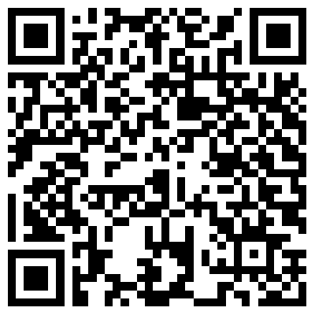
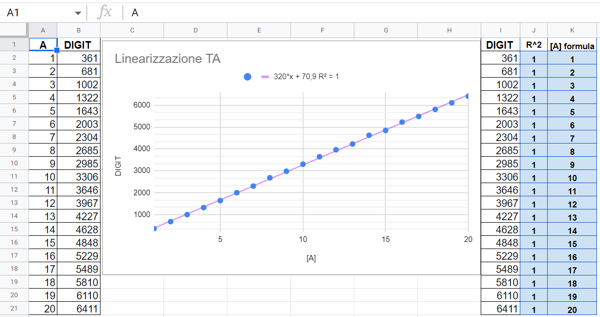

# Schools as Energy Community
## Campionato Nazionale Siemens 2023
 

### Premessa
Inserire riflessioni degli studenti sul tema ambientale - contributo docente di lettere Prof.ssa Lencioni 

### Finalità
Il presente progetto ha come finalità il monitoraggio energetico di edifici scolastici e di edifici in genere al fine di ottenere:
- in fase **preliminare** le informazioni utili per il risparmio energetico e per il dimensionamento di impianti di produzione da energia rinnovabile a servizio comunità energetiche;
- a **regime** le informazioni dettagliate circa il consumo degli impianti costituenti la comunità energetica.

Il monitoraggio energetico si riferisce sia all'energia **elettrica** sia all'energia **termica** o ad altra forma di energia prodotta o immagazzinata.

Il sistema di monitoraggio utilizza componenti a bassissimo costo di dimensioni ridotte e con alto livello di affidabilità. Alimentati a batteria sono adatti per essere inseriti in qualsiasi impianto in modo non intrusivo e sicuro, ovvero senza la necessità di dover intervenire e/o modificare i circuiti oggetto di monitoraggio.
Tali componenti sono in grado di trasmettere le informazioni senza intermediari web direttamente su Google Sheets per essere elaborati da opportuna interfaccia software.

Il progetto nasce dall'idea di monitorare i consumi della nostra scuola [IIS Galilei Artiglio](https://www.iisgalileiartiglio.edu.it/) per contribuire inizialmente ad individuare ed eliminare sprechi energetici e successivamente di fornire strumenti utili all'Amministrazione per la costituzione di comunità energetiche, esportando il sistema di monitoraggio in altre realtà pubbliche del territorio.

### Peculiarità del progetto
Il presente lavoro si rivolge a tutti, in particolare ai non esperti, utilizzando tecnologie robuste ed affidabili a bassisimo costo e open source come Google Scripts. La parola d'ordine è **semplificare il piu' possibile** rendendo accessibile a chiunque concetti e pratiche che spesso sono per addetti ai lavori. Pensiamo che ognuno debba essere e sentirsi protagonista in questa sfida importante a favore dell'ambiente e che le abilità e le competenze dell'esperto non debbano apparire come un sapere inaccessibile ma un "bene comune" da condividere. In altre parole chiunque abbia uno smartphone e ovunque si trovi, purchè vi sia un segnale WiFi disponibile, è in grado di *addestrare* il sistema di monitoraggio e di leggere i propri consumi energetici. Se poi in alternativa allo smartphone può indossare un paio di occhiali per la **realtà aumentata** tipo [Google Glass](https://www.google.com/glass/start/), allora può sfruttare appieno le potenzialità del sistema sviluppato, come descritto piu' avanti. Il progetto infatti sfrutta l'interfaccia di Google Sheets per consentire all'utente di **personalizzare** in modo semplice ma potente le proprie richieste.

Di seguito, oltre al video istituzionale del Campionato Siemens, saranno proposti dei video-tutorial esplicativi sull'addestramento e sull'utilizzo del sistema di monitoraggio.

### Semplificare la parola d'ordine ma ... senza banalizzare !
In passato l'energia elettrica è sempre stata intesa come un **servizio**. Oggi abbiamo compreso che in realtà è un **bene prezioso** da gestire attentamente. La sfida quindi è sfruttare al meglio l'energia consumandola quando è disponibile a prezzi vantaggiosi per l'utente. Questa affermazione ovvia, ma di non semplice attuazione, assume un peso maggiore di fronte a comunità energetiche dove la domanda e l'offerta da energia rinnovabile risponde a dinamiche proprie di ciascuna singola realtà costituente la comunità stessa. A questo punto verrebbe da chiedere: è possibile individuare, anche attraverso metodi di ricerca operativa, singole realtà presenti sul territorio comprese le scuole pensando di formare delle comunità energetiche gestendone in modo ottimizzato la domanda e l'offerta? In che modo si potrebbero gestire ottimamente questi flussi sfruttando la potenzialità dei PLC Siemens S7 1x00 ?  Per rispondere a queste domande occorre inizialmente allestire una campagna di monitoraggio dei consumi che utilizzi una tecnologia di facile installazione, "leggera" ed a basso costo, limitando al minimo essenziale i punti di misura. La caratterizzazione dei consumi di piu' utilizzatori attraverso un'unica misura a monte dell'impianto è un argomento studiato da tempo. Si possono trovare online diversi [studi accademici](https://scholar.google.it/scholar?q=non+intrusive+load+monitoring+academic&hl=it&as_sdt=0&as_vis=1&oi=scholart) che trattano l'argomento di questa tecnica che prende il nome di [NILM](https://en.wikipedia.org/wiki/Nonintrusive_load_monitoring) che significa *Non intrusive load monitoring*. Nella sostanza, alla base del metodo, c'è lo studio, la ricerca di come poter **disaggregare** il dato numerico della misura. Infatti ad ogni carico elettrico alimentato corrisponde ad un aumento di corrente totale assorbita. La misura a monte quindi è un dato **aggregato** che corrisponde alla somma di tutte le correnti assorbite

 

Ogni sforzo quindi è nel tentativo di riconoscere, partendo dal risultato finale ovvero la misura, il valore esatto dei vari contributi che lo generano. In pratica è un percorso inverso da come abitualmente lo conosciamo. E' come dire: il numero 10 è la somma di 3+2+5. Sì è vero, ma è anche il risultato della somma 6+4. Quale delle due ipotesi è quella giusta ? Per tentare di dare una risposta la tecnica NILM utilizza reti neurali ad hoc in combinazione al tipo di sensori utilizzati. Normalmente si tratta di sistemi chiusi o proprietari, ciascuno con un proprio grado di affidabilità.

Il progetto dell'[IIS Galilei Artiglio](https://www.iisgalileiartiglio.edu.it/) propone un metodo molto semplice per riconoscere i singoli contributi dei carichi **elettrici** e **termici**. L'addestramento o feedback al sistema è fatto direttamente nelle apposite caselle disponibili sul foglio Sheet di Google come mostrato piu' avanti nel videotutorial. 

### Realtà aumentata ###
I componentii utilizzati per il monitoraggio elettrico e termico sono costituiti da microprocessori ESP32 programmati in microPython collegati a sensori di corrente e temperatura 

**Circuito per la misura di CORRENTE**

**Circuito per la misura di TEMPERATURA**

Per rendere facilmente accessibile le misure in tempo reale, il presente progetto è in grado "da subito" di sfruttare la realtà aumentata per migliorare la percezione da parte dell'utente dei consumi. Nel caso ad esempio di impianti elettrici e termici solitamente vetusti a servizio delle scuole, si vuole offrire la possibilità al manutentore/tecnico all'Amministrazione Provinciale o Comunale, di avere l'andamento dei consumi osservando semplicemente il quadro elettrico o la centrale termica oggetto d'indagine.
Per far questo occorre indossare degli occhiali tipo [Google Glass](https://www.google.com/glass/start/) (in alternativa si può utilizzare uno smartphone o un tablet qualsiasi) e puntare il QR Code posto sul quadro elettrico o sull'utenza. Per la lettura del QR Code il progetto prevede l'utilizzo di [Google Lens](https://play.google.com/store/apps/details?id=com.google.ar.lens&hl=it&gl=US&pli=1).
Di seguito si riporta un QR Code per il lettore in modo da poter testare il funzionamento del sistema appena descritto: basta semplicemente inquadrare l'immagine sottostante anche attraverso uno smarphone per aprire la pagina "Graphs" di Google Sheets

Non è argomento di questo lavoro la cura dell'interfaccia grafica dei fogli se non nella misura funzionale e comprensibile per il raggiungimento delle finalità citate. Tuttavia si ricordano le diverse possibilità di creazione di interfacce utente attraverso le [Class Ui](https://developers.google.com/apps-script/reference/base/ui) di Google App Scripts nonchè attraverso l'installazione di componenti aggiuntivi dal menu *Estensioni*

### Architettura del sistema di monitoraggio
La figura seguente mostra in sintesi le relazioni tra i principali componenti del sistema di monitoraggio low cost ed i PLC S7 1x00 Siemens. Da notare che le informazioni scambiate tra gli ESP32 ed i PLC con i servizi APP Script utilizzati nel progetto, tra cui Google Sheets, avvengono **senza intermediari Web**.
 

I dati raccolti dal sistema di monitoraggio consentono di definire il **comportamento termodinamico degli edifici** nonchè **l'andamento temporale dei consumi energetici**. Successivamente quando la comunità energetica è attiva, il sistema di monitoraggio fornisce informazioni in tempo reale dei **periodi in cui i consumi risultano economicamente piu' favorevoli** a seguito della disponibilità della risorsa rinnovabile. Le stesse informazioni sono inoltre utilizzate per le attività di **manutenzione ordinaria e straordinaria degli impianti**. In altre parole il sistema di monitoraggio facilita la gestione e l'utilizzo di un impianto complesso a servizio di una comunità energetica rendendolo **accessibile** ovvero **fruibile** anche ad utenti non esperti. Da remoto è possibile interagire con il web server del PLC per gestire i diversi profili di carico. Solitamente gli impianti elettrici e termici delle scuole sono datati e non sono stati pensati per una gestione domotica dei carichi. Tuattia è possibile integrare in tali impianti uno o piu' PLC in grado di comandare interruttori motorizzati o attuatori in genere gestibili dai parametri personalizzabili su Google Sheets.

### Attività di laboratorio ###
#### Calibrazione TA ####
Il TA per la misura della corrente è stato testato con carichi crescenti utlizzando un amperometro da laboratorio

Il segnale analogico del TA è stato digitalizzato per l'acquisizione da parte dell'ESP32.
I valori digitali della tensione sono stati interpolati mediante regressione lineare.

#### Calibrazione PT100 ####
segue esperienza laboratorio

